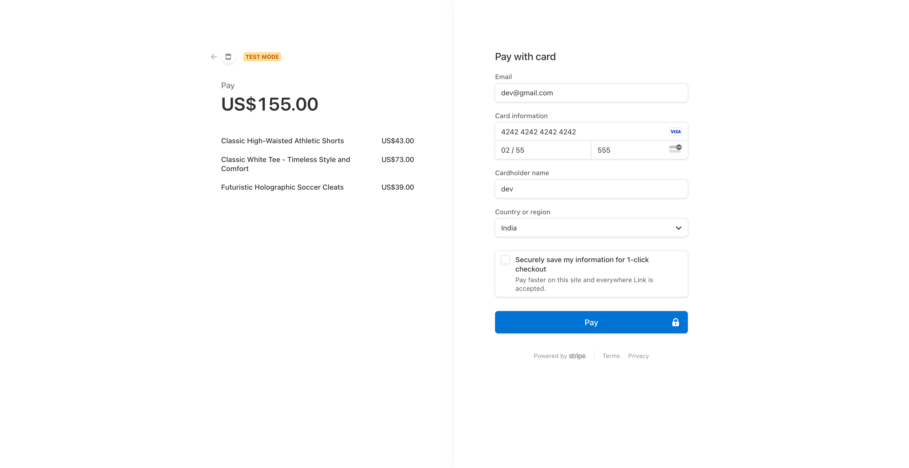
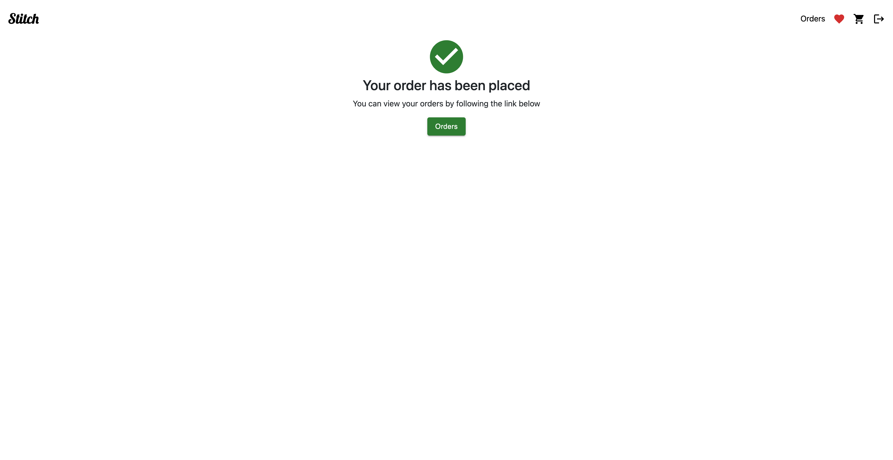

# About
**Stitch** is an e-commerce application built using microservice architecture. Check below for tech-stack used, architecture and how to run on your machine.

# Tech stack used
- mongodb, expressjs, reactjs, nodejs (MERN stack)
- Redux for state management
- MUI + react-boostrap for UI
- React-router for routing
- Stripe payment gateway
- Redis for caching
- Nginx as API gateway
- Docker for building and deploying services

# Project Architecture

# How to run this project ?
1. You need to have Docker installed in your machine
2. Before building and deploying, you need to have stripe account for payments
3. Headover to https://dashboard.stripe.com/register and register(select USD if in case it asks, INR might not be easy while registering)
4. Create public and secret keys here https://dashboard.stripe.com/test/apikeys and copy the secret key and paste as variable to `STRIPE_KEY` in `docker-compose.yml` under `checkout-app` `environment` variables.
5. Then head over to https://dashboard.stripe.com/test/webhooks and click `Add Local Listener` button and follow instructions there and you will end up generating a `webhook signing secret` (Please make sure to replace `stripe listen --forward-to localhost:4242/webhook` with `stripe listen --forward-to localhost:1616/pay/webhook` as this is the port and endpoint we have created inside `checkout-app` ) and copy that `webhook signing secret` and paste into `STRIPE_SECRET` variable in `docker-compose.yml` under `checkout-app` `environment` variables. Use test card number `4242424242424242424` and any valid expiry date and any cvv to make test payments.
6. That's all, do `docker-compose up` (Should run this command where `docker-compose.yml` is at)

# Screenshot and Video

### Login

### Products

### Product View

### Wishlist

### Cart

### Stripe Checkout

### After Payment

### Orders

<video src="./screenshots/screenrecord.mov" controls></video>
